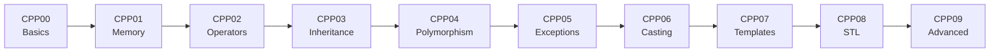

<div align="center">

# 🚀 C++ Mastery Journey
### *From Zero to Hero: Complete C++ Learning Path*

[](https://isocpp.org/)
[](https://42.fr/)
[](https://github.com)
[](LICENSE)

*Comprehensive C++ curriculum covering fundamental to advanced concepts through hands-on exercises*

---

</div>

## � Progress Overview

```
CPP00 ████████████████████████████████ 100% - Foundations
CPP01 ████████████████████████████████ 100% - Memory & Pointers  
CPP02 ████████████████████████████████ 100% - Operator Overloading
CPP03 ████████████████████████████████ 100% - Inheritance
CPP04 ████████████████████████████████ 100% - Polymorphism
CPP05 ████████████████████████████████ 100% - Exceptions
CPP06 ████████████████████████████████ 100% - Casting
CPP07 ████████████████████████████████ 100% - Templates
CPP08 ████████████████████████████████ 100% - STL Containers
CPP09 ████████████████████████████████ 100% - Advanced STL
```

<details>
<summary>🎓 <b>Module Breakdown</b></summary>

### 🏗️ **CPP00** - *Foundation & Basics*
> *Namespaces, Classes, Member Functions, I/O Streams, Static & Const*

| Exercise | Name | Concept | Status |
|:--------:|:-----|:--------|:------:|
| **00** | 🔊 Megaphone | C++ basics & I/O | ✅ |
| **01** | 📱 PhoneBook | Classes & objects | ✅ |
| **02** | 🏦 Account Class | Static members & logging | ✅ |

### 🧠 **CPP01** - *Memory Mastery*  
> *Dynamic Allocation, Pointers, References, Function Pointers*

| Exercise | Name | Concept | Status |
|:--------:|:-----|:--------|:------:|
| **00** | 🧟 BraiiiiiiinnnzzzZ | Dynamic allocation | ✅ |
| **01** | 🧟‍♀️ Moar Brainz! | Object arrays | ✅ |
| **02** | 🧠 HI THIS IS BRAIN | Pointers vs references | ✅ |
| **03** | ⚔️ Unnecessary Violence | References & objects | ✅ |
| **04** | 📝 Sed is for Losers | File manipulation | ✅ |
| **05** | 💬 Harl 2.0 | Function pointers | ✅ |
| **06** | 🔍 Harl Filter | Switch statements | ✅ |

### ⚙️ **CPP02** - *Operator Overloading*
> *Ad-hoc Polymorphism, Orthodox Canonical Form*

| Exercise | Name | Concept | Status |
|:--------:|:-----|:--------|:------:|
| **00** | 🏛️ Orthodox Canonical Form | Basic class structure | ✅ |
| **01** | 🔢 Fixed-Point Numbers | Operator overloading | ✅ |
| **02** | 🧮 Arithmetic Operations | Math operators | ✅ |
| **03** | 📐 BSP Algorithm | Geometric calculations | ✅ |

### 🔄 **CPP03** - *Inheritance Hierarchy*
> *Base Classes, Derived Classes, Multiple Inheritance*

| Exercise | Name | Concept | Status |
|:--------:|:-----|:--------|:------:|
| **00** | 🤖 ClapTrap | Base class design | ✅ |
| **01** | 🛡️ ScavTrap | Single inheritance | ✅ |
| **02** | 💥 FragTrap | Multiple inheritance | ✅ |
| **03** | 💎 DiamondTrap | Diamond problem & virtual inheritance | ✅ |

### 🎭 **CPP04** - *Polymorphism & Abstraction*
> *Virtual Functions, Abstract Classes, Interfaces*

| Exercise | Name | Concept | Status |
|:--------:|:-----|:--------|:------:|
| **00** | 🐾 Animal Kingdom | Virtual functions | ✅ |
| **01** | 🔥 Brain Management | Deep copy & memory | ✅ |
| **02** | 🏛️ Abstract Classes | Pure virtual functions | ✅ |
| **03** | ⚗️ Materia System | Interfaces & patterns | ✅ |

### ⚠️ **CPP05** - *Exception Handling*
> *Try-Catch, Custom Exceptions, RAII*

| Exercise | Name | Concept | Status |
|:--------:|:-----|:--------|:------:|
| **00** | 👔 Bureaucrat | Exception basics | ✅ |
| **01** | 📋 Form Validation | Custom exceptions | ✅ |
| **02** | 📝 Concrete Forms | Exception hierarchy | ✅ |
| **03** | 👨‍💼 Intern Factory | Factory pattern | ✅ |

### 🔄 **CPP06** - *Type Casting*
> *Static, Dynamic, Const, Reinterpret Casts*

| Exercise | Name | Concept | Status |
|:--------:|:-----|:--------|:------:|
| **00** | 🔄 Scalar Conversion | Static cast | ✅ |
| **01** | 💾 Serialization | Reinterpret cast | ✅ |
| **02** | 🔍 Type Identification | Dynamic cast & RTTI | ✅ |

### 📝 **CPP07** - *Template Magic*
> *Function Templates, Class Templates, Specialization*

| Exercise | Name | Concept | Status |
|:--------:|:-----|:--------|:------:|
| **00** | 🎯 Function Templates | Template basics | ✅ |
| **01** | 🔄 Iterator Functions | Template iteration | ✅ |
| **02** | 📦 Array Container | Class templates | ✅ |

### 🗂️ **CPP08** - *STL Containers*
> *Containers, Iterators, Algorithms*

| Exercise | Name | Concept | Status |
|:--------:|:-----|:--------|:------:|
| **00** | 🔍 Easy Find | STL algorithms | ✅ |
| **01** | 📏 Span Container | Custom containers | ✅ |
| **02** | 🧬 Mutated Stack | Advanced operations | ✅ |

### 🏆 **CPP09** - *Advanced STL*
> *Complex Containers, Performance, Real-world Applications*

| Exercise | Name | Concept | Status |
|:--------:|:-----|:--------|:------:|
| **00** | 💰 Bitcoin Exchange | Map containers & parsing | ✅ |
| **01** | 🔄 RPN Calculator | Stack implementation | ✅ |
| **02** | ⚡ PmergeMe Sorter | Performance comparison | ✅ |

</details>

---

## 🛠️ Quick Start Guide

### Prerequisites
```bash
# Required tools
sudo apt-get update
sudo apt-get install build-essential make git
```

### Build & Run
```bash
# Clone the repository
git clone https://github.com/Xylar-99/CPP.git
cd CPP

# Navigate to any exercise
cd CPP[XX]/ex[XX]

# Compile and run
make && ./[program_name]
```

### Available Make Commands
| Command | Description |
|---------|-------------|
| `make` | 🔨 Compile the project |
| `make clean` | 🧹 Remove object files |
| `make fclean` | 🗑️ Remove all generated files |
| `make re` | 🔄 Clean and rebuild |

---

## 🎯 Learning Path & Skill Development

<table>
<tr>
<td width="50%">

### 🏗️ **Fundamental Concepts**
- ✅ Object-Oriented Programming
- ✅ Memory Management (RAII)
- ✅ Const Correctness
- ✅ Orthodox Canonical Form
- ✅ Resource Management

</td>
<td width="50%">

### 🚀 **Advanced Features**
- ✅ Template Programming
- ✅ STL Mastery
- ✅ Exception Safety
- ✅ Design Patterns
- ✅ Performance Optimization

</td>
</tr>
</table>

### 📈 Complexity Progression



---

## 💡 Key Features & Highlights

<div align="center">

| 🎨 **Clean Code** | 🔒 **Memory Safe** | ⚡ **Performance** | 🧪 **Tested** |
|:-----------------:|:-----------------:|:-----------------:|:-------------:|
| Follows C++98 standards | RAII principles | Optimized algorithms | Comprehensive examples |
| Consistent style | No memory leaks | Efficient data structures | Edge cases covered |
| Self-documenting | Exception safe | Benchmarked solutions | Real-world scenarios |

</div>

---

## 📚 Technical Specifications

<details>
<summary><b>🔧 Compiler & Build System</b></summary>

```makefile
# Standard Makefile configuration used across all exercises
CXX = c++
CXXFLAGS = -Wall -Wextra -Werror -std=c++98
NAME = [exercise_name]
SRCS = *.cpp
OBJS = $(SRCS:.cpp=.o)
```

**Supported Compilers:**
- GCC 4.8+ 
- Clang 3.3+
- MSVC 2015+ (with adaptations)

</details>

<details>
<summary><b>🎯 Coding Standards</b></summary>

- **C++98 Standard**: Full compatibility ensured
- **42 Norm**: Follows school coding conventions  
- **Orthodox Canonical Form**: Implemented where applicable
- **SOLID Principles**: Applied throughout the codebase
- **Exception Safety**: Strong exception guarantee provided

</details>

<details>
<summary><b>📊 Performance Metrics</b></summary>

| Module | Complexity | Memory Usage | Compilation Time |
|--------|------------|--------------|------------------|
| CPP00-02 | O(1)-O(n) | Minimal | < 5s |
| CPP03-05 | O(n)-O(n²) | Moderate | < 10s |
| CPP06-09 | O(n log n) | Optimized | < 15s |

</details>

---

## 🌟 Showcase Projects

### 🏆 **Featured Implementations**

<table>
<tr>
<td align="center" width="33%">

**📱 PhoneBook**<br/>
*CPP00/ex01*

Interactive contact manager with advanced search capabilities

</td>
<td align="center" width="33%">

**🧟 Zombie Horde**<br/>
*CPP01/ex01*

Dynamic memory management showcase with object lifecycle control

</td>
<td align="center" width="33%">

**💎 DiamondTrap**<br/>
*CPP03/ex03*

Complex inheritance hierarchy demonstrating virtual inheritance

</td>
</tr>
<tr>
<td align="center">

**⚗️ Materia System**<br/>
*CPP04/ex03*

Abstract interface implementation with factory pattern

</td>
<td align="center">

**📝 Form Factory**<br/>
*CPP05/ex03*

Exception-safe form processing with custom error handling

</td>
<td align="center">

**⚡ PmergeMe**<br/>
*CPP09/ex02*

High-performance sorting algorithm comparison

</td>
</tr>
</table>

---

## 📖 Learning Resources

<div align="center">

### 🎓 **Recommended Reading**

| Level | Resource | Focus Area |
|:-----:|:---------|:-----------|
| 🟢 **Beginner** | [C++ Primer](https://www.informit.com/store/c-plus-plus-primer-9780321714114) | Fundamentals |
| 🟡 **Intermediate** | [Effective C++](https://www.aristeia.com/books.html) | Best Practices |
| � **Advanced** | [Modern C++ Design](https://erdani.com/) | Advanced Techniques |

### 🌐 **Online References**

[](https://en.cppreference.com/)
[](https://isocpp.github.io/CppCoreGuidelines/)
[](https://stackoverflow.com/questions/tagged/c%2b%2b)

</div>

---

## 🤝 Contributing & Feedback

<div align="center">

**Found this helpful?** ⭐ Star this repository!

**Have suggestions?** 💡 Open an issue or submit a PR!

**Questions?** 💬 Feel free to reach out!

---

### 📊 **Repository Stats**


---

<sub>*Part of the 42 School C++ curriculum • Crafted with ❤️ for learning*</sub>

</div>
